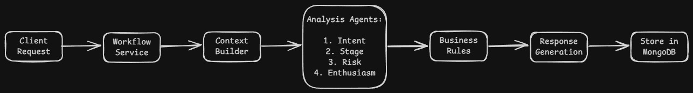
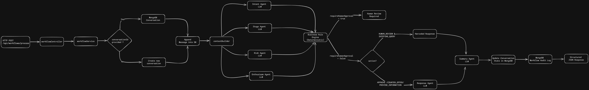

# Creator Negotiation Workflow

Backend service that automates creator-brand negotiation for affiliate marketing campaigns. Receives a creator message, classifies intent and conversation stage, applies business rules, and returns a structured decision with a draft response.

## Table of Contents

- [Architecture](#architecture)
- [Project Structure](#project-structure)
- [Workflow Execution](#workflow-execution)
- [LLM Usage](#llm-usage)
- [Business Rules](#business-rules)
- [State Management](#state-management)
- [API Reference](#api-reference)
- [Setup](#setup)
- [Test Scenarios](#test-scenarios)
- [Scaling Considerations](#scaling-considerations)
- [Engineering Tradeoffs](#engineering-tradeoffs)
- [Bonus Features Implemented](#bonus-features-implemented)

## Architecture

Express REST API backed by MongoDB. The core workflow is a linear pipeline of LLM agents followed by a deterministic business rules engine. State is persisted across turns via a Conversation document.

## High-Level Workflow



## Detailed System Architecture



Two MongoDB collections:
- Conversation: mutable, tracks current negotiation state across turns
- WorkflowRun: immutable audit log, one record per workflow execution

## Workflow Execution

1. **Load or Create Conversation**
   - If a `conversationId` is provided, load the existing conversation and append the new creator message.
   - Otherwise, create a new conversation record.

2. **Build Context**
   - Retrieve the most recent conversation history.
   - Trim history to the last 10 messages.
   - Attach the rolling conversation summary to provide long-term context while controlling token usage.

3. **Run Analysis Agents**
   - Execute the Intent Agent, Stage Agent, Risk Agent, and Enthusiasm Agent.
   - Each agent produces structured outputs used by downstream business logic.

4. **Apply Business Rules**
   - Pass all agent outputs into a deterministic rules engine.
   - The rules engine determines:
     - Workflow action
     - Escalation requirements
     - Human approval requirements

5. **Generate Draft Reply**
   - Generate a contextual response using the Response Agent.
   - Certain actions such as `HUMAN_REVIEW` and `SHIPPING_QUERY` use predefined responses to avoid hallucinations.

6. **Generate Conversation Summary**
   - Produce a concise rolling summary of the conversation.
   - Store the summary for future turns and context compression.

7. **Persist Workflow State**
   - Update the Conversation document.
   - Store a WorkflowRun record containing the full workflow execution for auditing and debugging.

8. **Return Structured Result**
   - Return the workflow decision, agent outputs, escalation status, and draft reply to the caller.


## Project Structure

```
src/
  config/       # MongoDB + Ollama client
  controllers/  # HTTP request handling
  routes/       # Route definitions
  models/       # Mongoose schemas (Conversation, WorkflowRun)
  rules/        # Deterministic business rules engine
  services/
    agents/     # LLM agents (intent, stage, risk, enthusiasm, response, summarizer)
    context/    # Context builder
  utils/        # Budget extraction, LLM JSON wrapper, logger
```

## LLM Usage

The workflow intentionally uses multiple specialized agents rather than a single large prompt. Each agent has a narrow responsibility, making the system easier to test, extend, and debug.

| Agent                | Responsibility                                                                        | Why Separate Agent?                                                                                 |
| -------------------- | ------------------------------------------------------------------------------------- | --------------------------------------------------------------------------------------------------- |
| **Intent Agent**     | Detect creator intent and extract structured data such as requested compensation.     | Intent detection is a distinct NLP problem and should not be coupled with business decision-making. |
| **Stage Agent**      | Determine the overall conversation stage.                                             | Stage depends on broader conversation context rather than only the latest message (Specifically past 10 messages in the current context).                  |
| **Risk Agent**       | Detect potential fraud, abusive behavior, suspicious requests, or risky negotiations. | Risk assessment often evolves independently of intent and can trigger separate escalation logic.    |
| **Enthusiasm Agent** | Measure creator engagement and partnership interest.                                  | Useful for prioritization and future creator scoring systems.                                       |
| **Response Agent**   | Generate contextual merchant replies.                                                 | Keeps response generation isolated from classification logic.                                       |
| **Summarizer Agent** | Maintain rolling conversation summaries.                                              | Reduces token usage and improves long-running conversation handling.                                |

### Benefits of the Multi-Agent Approach

* **Modularity** – Each agent can be developed, tested, and improved independently.
* **Maintainability** – Changes to one capability do not require modifying the entire workflow.
* **Observability** – Individual agent outputs can be logged and inspected for debugging.
* **Scalability** – New agents can be added without redesigning the existing architecture.
* **Reliability** – Structured intermediate outputs reduce prompt complexity and improve consistency.

## Deterministic Business Rules

All workflow decisions are made by a deterministic rules engine (`src/rules/businessRules.js`). LLMs are used only for analysis and classification; final business decisions remain rule-based, auditable, and fully explainable.

| Condition | Action | Reasoning |
|------------|---------|-----------|
| Classification confidence is below **0.7** | **Human Review** | Low-confidence predictions should not drive automated business decisions. |
| Risk level is **HIGH** | **Human Review** | Potential fraud, abuse, or suspicious requests require manual inspection. |
| Negotiation rounds reach **4 or more** | **Human Review** | Prevents endless automated negotiation loops and allows a human to intervene. |
| Creator requests additional campaign information | **Provide Information** | The creator needs clarification before making a decision. |
| Requested compensation exceeds **2× the campaign budget** | **Human Review** | Large budget mismatches typically require merchant approval or custom negotiation. |
| Creator declines the collaboration | **Close Conversation** | No further automated negotiation is necessary. |
| Requested compensation exceeds the campaign budget but remains within an acceptable range | **Counter Offer** | Attempts to continue negotiation while staying within campaign constraints. |
| No escalation conditions are triggered | **Approve** | Creator request aligns with campaign requirements and budget expectations. |

## State Management

Conversation state is stored in MongoDB. Key fields on Conversation:

- messages[]: full message history (CREATOR / BRAND roles)
- currentStage: latest classified stage
- negotiationRounds: counter incremented each NEGOTIATING turn
- enthusiasmScore: latest creator enthusiasm score
- riskLevel: latest risk classification
- conversationSummary: rolling LLM-generated summary
- requiresHumanApproval: flag for human intervention
- workflowStatus: ACTIVE | WAITING_HUMAN | COMPLETED

Conversation history is trimmed to the last 10 messages before being passed to agents to control context size.

## API

`POST /api/workflows/process`

Request body:

```json
{
  "creator": { "name": "Sarah", "platform": "TikTok", "followers": 25000 },
  "campaign": {
    "product": "Uno Card Game",
    "commission": "30%",
    "fixedFeeRange": "$0-$100",
    "brief": "Creator should make a short TikTok showing friends playing the card game."
  },
  "latestMessage": "I'd be interested, but I usually charge $300.",
  "conversationId": "<OPTIONAL, omit for new conversation>"
}
```

Response:

```json
{
  "success": true,
  "data": {
    "conversationId": "...",
    "currentStage": "NEGOTIATING",
    "intent": "NEGOTIATE_COMPENSATION",
    "recommendedAction": "HUMAN_REVIEW",
    "requiresHumanApproval": true,
    "workflowStatus": "WAITING_HUMAN",
    "confidence": 0.98,
    "enthusiasmScore": 82,
    "riskLevel": "LOW",
    "negotiationFatigue": false,
    "conversationSummary": "...",
    "draftReply": "...",
    "reasoningSummary": "Requested fee exceeds twice the campaign budget."
  }
}
```

## Test Scenarios

Individual agent tests: `node test-intent.js`, `test-stage.js`, `test-risk.js`, etc.

Full workflow: `node test-workflow.js` (requires MongoDB and Ollama running locally).

Detailed end-to-end test scenarios are documented in:

📄 **[SCENARIOS.md](./SCENARIOS.md)**

## Setup

```bash
cp .env.example .env   # fill in MONGODB_URI and LLM_MODEL
npm install
npm run dev
```

Requires: Node 18+, MongoDB, Ollama with qwen2.5:7b (or set LLM_MODEL env var).

## Bonus Features Implemented

The assignment listed several optional enhancements. The following were implemented:

| Feature                             | Implementation                                                                                  |
| ----------------------------------- | ----------------------------------------------------------------------------------------------- |
| **Workflow State Storage**          | MongoDB Conversation documents maintain persistent workflow state across interactions.          |
| **Multi-Step Negotiation Workflow** | Conversations continue across multiple turns using a unique `conversationId`.                   |
| **Conversation Summarization**      | Rolling LLM-generated summaries are stored and reused to reduce context size.                   |
| **Escalation Paths**                | Conversations can be routed for human review through a `WAITING_HUMAN` workflow status.         |
| **Workflow Audit Logging**          | Every workflow execution is recorded in a dedicated `WorkflowRun` collection.                   |
| **Human Approval Flow**             | Deterministic business rules trigger approval requirements when needed.                         |
| **Additional Business Rules**       | Includes negotiation fatigue detection, confidence thresholds, and risk-based escalation logic. |

## Additional Features Beyond Assignment Requirements

The following capabilities were not explicitly required but were implemented to improve robustness and production readiness.

### Risk Assessment Agent

Evaluates creator messages for potentially problematic behavior such as suspicious requests, abusive language, or negotiation patterns that may require escalation.

### Enthusiasm Scoring

Calculates a structured creator engagement score that can support future creator ranking, prioritization, and campaign matching systems.

### Confidence-Based Escalation

Automatically routes conversations for human review when LLM classification confidence falls below predefined thresholds.

### Negotiation Fatigue Detection

Tracks repeated negotiation cycles and escalates conversations that exceed acceptable negotiation limits, preventing endless automated back-and-forth exchanges.

### Hallucination Prevention

Response generation is constrained to campaign-provided information and explicitly prevents inventing:

* Shipping timelines
* Deliverables
* Product details
* Compensation promises

unless such information is present in the campaign data.

### Immutable Audit Trail

Every workflow execution is stored independently from conversation state, enabling debugging, traceability, analytics, and compliance auditing.


## Scaling Considerations

1,000 creators: Current architecture handles this without changes. Add indexing on collections.

10,000 creators: Move agent execution to a job queue (BullMQ + Redis). HTTP endpoint enqueues the job and returns a job ID; client polls or receives a webhook. Run Ollama on a dedicated GPU instance. Parallelise the analysis agents with Promise.all().

100,000 creators: Shard MongoDB or migrate to PostgreSQL. Replace Ollama with a hosted LLM API (Anthropic, OpenAI) for reliability and throughput. Introduce a proper orchestration layer (Temporal) for durable workflow execution with retry, timeout, and human task queues. Add a caching layer (Redis) for campaign data.


## Engineering Tradeoffs and Production Considerations

This implementation was intentionally scoped for the assessment and prioritizes clarity, maintainability, and ease of evaluation over full production-scale architecture.

The current design demonstrates the core workflow while highlighting areas that would evolve in a production environment.

### Sequential Agent Execution

#### Current Implementation

Agents execute sequentially:

```text
Intent Agent
      ↓
Stage Agent
      ↓
Risk Agent
      ↓
Enthusiasm Agent
```

#### Why

* Simpler implementation
* Easier debugging
* Clear visibility into intermediate outputs
* Straightforward workflow tracing

#### Production Approach

Since these agents are independent, they could execute concurrently:

```text
Intent Agent
Stage Agent
Risk Agent
Enthusiasm Agent
        ↓
    Promise.all()
```

Benefits:

* Lower end-to-end latency
* Better throughput
* More efficient resource utilization

---

### MongoDB as Workflow Store

#### Current Implementation

MongoDB stores:

* Conversation state
* Workflow metadata
* Audit logs

#### Why

* Rapid development
* Flexible schema evolution
* Minimal infrastructure complexity

#### Production Approach

A larger-scale deployment would likely separate responsibilities:

* PostgreSQL for transactional workflow state
* Redis for caching and queues
* Dedicated analytics datastore for reporting and observability

---

### Local LLM Inference

#### Current Implementation

* Ollama
* Qwen 2.5 7B model
* Fully local execution

#### Why

* No API costs
* Easy reproducibility
* Offline development environment

#### Production Approach

* Hosted OpenAI or Anthropic models
* Auto-scaling inference infrastructure
* Multi-model routing
* Fallback and failover strategies

---

### Human Review Workflow

#### Current Implementation

Human escalation is represented through a workflow status:

```text
WAITING_HUMAN
```

and deterministic approval requirements.

#### Production Approach

A complete review system would include:

* Approval queue management
* Reviewer assignment
* Approval SLA tracking
* Escalation monitoring

---

### Retry and Failure Handling

#### Current Implementation

* Standard request-level error handling
* Workflow failure response

#### Production Approach

Robust workflow systems typically include:

* Exponential backoff
* Agent-specific retry policies
* Dead-letter queues
* Partial workflow recovery
* Workflow resumption from checkpoints

---

### Context Management

#### Current Implementation

Context is built using:

* Recent conversation messages
* Rolling conversation summaries

#### Why

Provides sufficient context while controlling token usage.

#### Production Approach

More advanced systems would leverage:

* Retrieval-based context selection
* Vector search
* Semantic memory retrieval
* Long-term conversation memory

---
